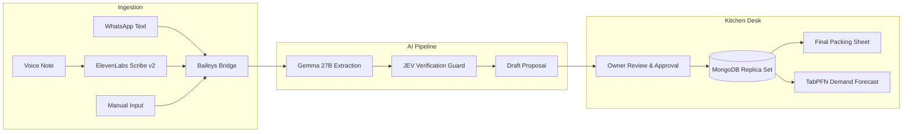

# TiffinDelta · More Cooking. Less Chasing.

> **AI-Powered Order Reconciliation & Daily Dispatch Desk for Independent Tiffin Services & Home Kitchens.**
> Built for the **Hacktoberfest Weekend Challenge: Build for a Friend**.

[]()
[]()
[]()
[]()
[]()

---

## 🍲 The Problem It Solves

Small tiffin sellers and home kitchens cook for dozens of daily subscribers. Customers rarely order through fancy apps; they text on **WhatsApp** or send quick **voice notes**:
- *"Skip lunch today, out of town!"*
- *"Send 2 extra tiffins tomorrow for guests."*
- *"Pause my meal plan until next Monday."*

**The Chaos:** Kitchen owners track these messages on scraps of paper or mentally while cooking. 
- **Missed cancellations** $\rightarrow$ Cooked food and packaging get wasted.
- **Missed extras** $\rightarrow$ Hungry, frustrated regulars.
- **Existing POS/restaurant software** is built for dine-in tables, not daily recurring subscriptions with frequent exception dates.

**The TiffinDelta Solution:** An automated bridge that ingests WhatsApp messages and voice notes, transforms them into verified one-click review proposals using a multi-model AI pipeline, and produces an **immutable, finalized daily packing sheet**.

---

## ⚡ Core Philosophy: "AI Proposes, Human Disposes"

TiffinDelta never modifies customer meal plans silently. 
1. **AI extracts & drafts**: The AI reads messy text/voice notes and constructs structured proposals with cited evidence spans.
2. **Kitchen owner confirms**: With a single tap, the owner approves, edits, or discards the proposal.
3. **Deterministic Math & Transactions**: Quantities, dates, and state revisions are enforced by ACID MongoDB replica-set snapshot transactions. Double-importing a message never double-counts a meal.

---

## 🤖 What Each AI Model Does

We don't use AI as a generic chatbot gimmick. Every model performs a specialized, narrow task:

| Model | Purpose | Why This Model? |
| :--- | :--- | :--- |
| **ElevenLabs Scribe v2** | **Voice Note Parsing** | Customers often send voice notes in regional languages or noisy backgrounds. Scribe v2 provides low-latency, high-accuracy speech-to-text at a fraction of standard transcription costs. |
| **Gemma 27B** *(via Backboard)* | **Intent & Entity Extraction** | Parses messy, informal messages into structured intent (`set_daily_quantity`, `pause_plan`, `resume_plan`), matching customer aliases, dates, and meal quantities. |
| **JEV (Judge / Evaluation Verifier)** | **Confidence & Hallucination Guard** | A specialized verification model that audits Gemma's extraction against the raw source text. Scores confidence, verifies exact text spans, and blocks hallucinations before any database write. |
| **TabPFN** | **Zero-Shot Demand Forecasting** | Tabular foundation model that predicts next-day meal counts and ingredient demand based on weekday trends, historical cancellations, and weather without costly training. |

---

## 🌟 Key Features

1. **📱 Native WhatsApp Web QR Bridge**
   - Built-in Baileys WhatsApp Web socket connection.
   - Scan a QR code from "Linked Devices" on your kitchen phone; syncs customer contacts and streams incoming meal change messages in real time.
2. **🎙️ Voice Note Audio Transcriber**
   - Direct audio stream processing using ElevenLabs Scribe v2.
   - Converts colloquial voice instructions directly into text for downstream AI classification.
3. **📋 Review & Approval Workbench**
   - Clean, high-contrast kitchen UI showing pending change drafts side-by-side with original messages.
   - Highlights exact text evidence and warns against conflicting historical edits.
4. **📦 Immutable Daily Packing Sheets & CSV Export**
   - Automatically computes final meal counts per customer and building.
   - Finalizes sheets with cryptographically verifiable revision history and instant CSV export.
5. **📈 Zero-Shot Demand Forecasting**
   - Predicts tomorrow’s order volume before messages arrive to prevent kitchen over-preparation.
6. **🛡️ Enterprise-Grade Multi-Tenant Architecture**
   - Google OAuth via **Better-Auth** with in-memory session protection.
   - Per-tenant API rate limiting (`RateLimiterMongo`) with automatic TTL garbage collection.
   - GDPR-compliant complete data export and atomic seller erasure operations.

---

## 🏗️ System Architecture & Workflow



---

## 🛠️ Technology Stack

- **Framework**: [Next.js 16.3.8](https://nextjs.org/) (App Router, Turbopack, Server Actions)
- **Frontend**: [React 19](https://react.dev/), [Tailwind CSS v4](https://tailwindcss.com/), Radix / Base UI Primitives, Lucide Icons
- **Database**: [MongoDB Atlas](https://www.mongodb.com/atlas) (Replica Set with Snapshot Isolation Transactions & TTL Indexing)
- **Authentication**: [Better-Auth 1.7.7](https://www.better-auth.com/) + Google OAuth
- **AI & ML**: [Backboard SDK](https://backboard.io/) (Gemma 27B, JEV), [ElevenLabs API](https://elevenlabs.io/), TabPFN
- **Messaging**: [@whiskeysockets/baileys](https://github.com/WhiskeySockets/Baileys) (WhatsApp Web Multi-Device Socket)
- **Quality & Safety**: [Vitest](https://vitest.dev/) (197 unit/contract tests, 16 integration tests), Strict TypeScript, Zod Schema Runtime Validation

---

## 🚀 Quick Start Guide

### Prerequisites
- Node.js 24+
- pnpm 10.33+
- MongoDB 7.0+ Replica Set (or free MongoDB Atlas cluster)

### 1. Installation
```bash
git clone https://github.com/your-username/taptutor.git
cd taptutor
pnpm install
```

### 2. Environment Setup
Copy `.env.example` to `.env`:
```bash
cp .env.example .env
```
Fill in the core variables:
```ini
MONGODB_URI=mongodb+srv://<user>:<password>@cluster0.mongodb.net
MONGODB_DB=taptutor_prod
BETTER_AUTH_SECRET=your_32_char_random_secret
BETTER_AUTH_URL=http://localhost:3000
GOOGLE_CLIENT_ID=your_google_client_id
GOOGLE_CLIENT_SECRET=your_google_client_secret
APP_ORIGIN=http://localhost:3000
APP_ENV=development

# Optional AI Providers:
ELEVENLABS_API_KEY=your_elevenlabs_api_key
BACKBOARD_API_KEY=your_backboard_api_key
```

### 3. Initialize Database Indexes
Runs replica-set verification and builds required unique, compound, and TTL indexes:
```bash
pnpm db:init
```

### 4. Run Development Server
```bash
pnpm dev
```
Open [http://localhost:3000](http://localhost:3000) in your browser.

---

## 🧪 Testing & Verification

The codebase features complete contract and integration coverage:

```bash
# Run all 197 unit & contract tests
pnpm test

# Run 16 real MongoDB replica-set integration tests
pnpm test:integration

# Run AI contracts (Backboard Gemma/JEV pipeline)
pnpm test:ai:contract

# Run TabPFN forecasting tests
pnpm test:forecast

# Run TypeScript typechecking & ESLint
pnpm typecheck
pnpm lint

# Production bundle build
pnpm build
```

---

## 📄 License

Built for **Hacktoberfest Weekend Challenge: Build for a Friend**. Licensed under the [MIT License](LICENSE).
